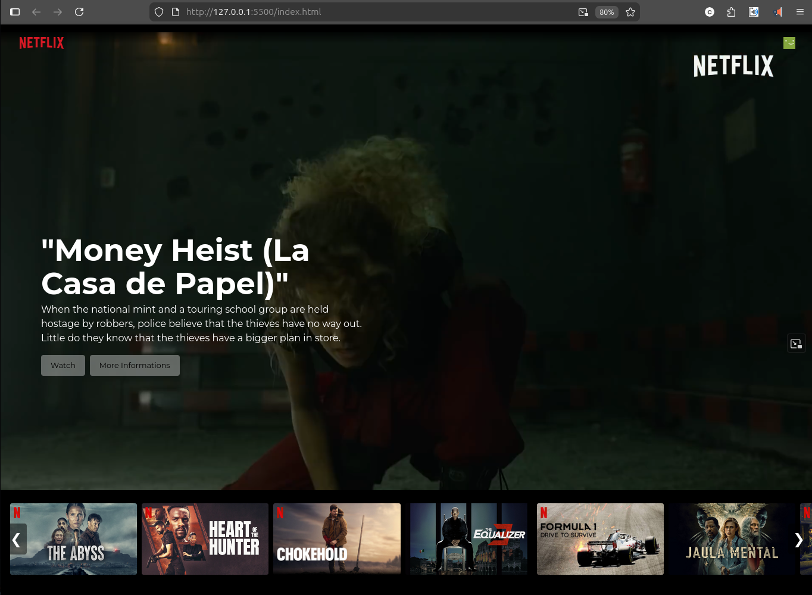

# NextFlix – Netflix-Inspired Frontend UI

## Overview

NextFlix is a Netflix-inspired frontend web interface built with HTML, CSS, and JavaScript.  
This project simulates a streaming platform layout, featuring a dynamic hero section, video background, interactive UI elements, and a custom movie carousel.

The project was initially developed following a guided tutorial and later refactored and enhanced independently with additional features and improvements.

---

## Purpose of the Project

The main goal of this project was to practice and consolidate core frontend development skills, including layout structuring, responsive design, and UI interactivity.

Key learning focus areas:
- Real-world UI layout structuring
- Responsive design techniques
- DOM-based interactivity with JavaScript
- Working with multimedia (video and audio assets)
- Component-based thinking in frontend development

---

## Features

- Responsive landing page layout inspired by Netflix
- Hero section with background video
- Interactive buttons and modal window
- Horizontal movie carousel with navigation controls
- Hover animations and UI feedback effects
- Audio integration (custom sound effect)
- Clean component-based structure

---

## Technologies Used

- HTML5
- CSS3 (Flexbox, Grid, Animations)
- JavaScript (DOM manipulation, UI interaction)
- Bootstrap (CDN utilities)

---

## Preview



---

## 📂 Project Structure

project-folder/
├── index.html
├── css/
│ └── style.css
├── js/
│ └── scripts.js
├── assets/
│ ├── images/
│ ├── icons/
│ ├── audio/
│ └── video/
└── README.md


---

## How to Run the Project

1. Clone the repository: 
```
git clone https://github.com/celinorfonseca/nextflix-project

```

2. Open the project folder

3. Open `index.html` in your browser

---

## What I Learned

- Structuring responsive layouts using Flexbox and Grid
- Building reusable UI components
- Enhancing UI with animations and hover effects
- Managing multimedia assets in web projects
- Improving code structure and readability
- Applying iterative improvements based on feedback and self-study

---

## Future Improvements

- Improve mobile responsiveness and breakpoints
- Refactor JavaScript into modular structure
- Add dynamic content loading
- Improve accessibility (ARIA roles, keyboard navigation)
- Optimize performance and asset loading

---

## Note

This project was initially built following a guided tutorial and later extended with personal improvements and custom features. It represents a learning and refinement process in frontend development.

---

## Author

Celinor Lima da Fonseca Júnior